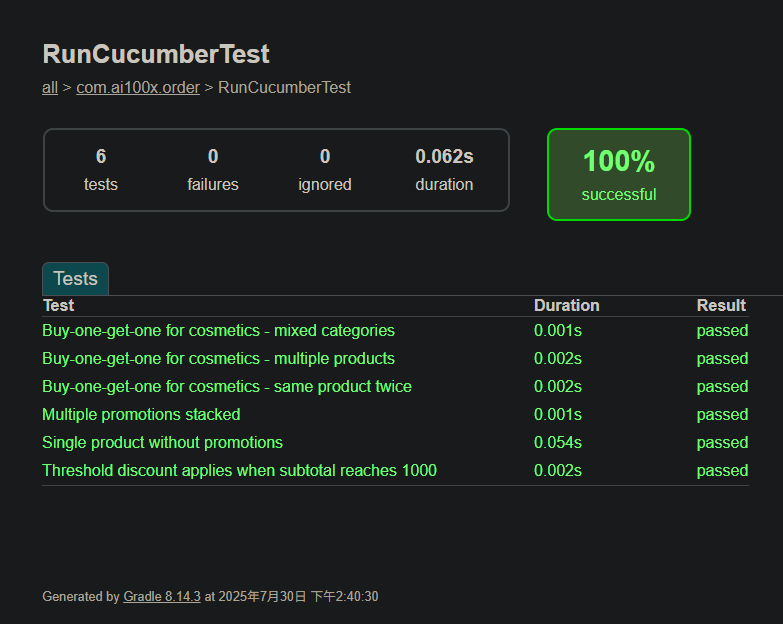

# AI-100x-SE-Join-Quest 專案說明

## 專案簡介
本專案以 BDD (行為驅動開發) 流程設計，實作電商訂單促銷計算，涵蓋多種促銷情境（滿額折扣、化妝品買一送一、疊加優惠等），並以 Cucumber 進行驗收測試。

## 專案結構
```
AI-100x-SE-Join-Quest/
├── build.gradle
├── src/
│   ├── main/java/com/ai100x/order/
│   └── test/java/com/ai100x/order/
│   └── test/resources/order.feature
├── BDD pricing/
│   ├── DEV_REPORT.md
│   └── order.feature
├── img/
│   └── screenshots.png
```

## 執行方式
1. 於專案根目錄執行 `./gradlew.bat test`。
2. 測試報告可於 `build/reports/tests/test/index.html` 查看。

## 圖片展示


## 心得分享
本次專案以 AI 輔助實作，結合 BDD 流程與測試導向開發，體會到以下幾點：

1. **AI 實作加速**：透過 AI 工具協助撰寫程式、生成步驟定義與測試案例，大幅提升開發效率，減少重複性工作。
2. **測試導向思維**：每個功能皆以驗收測試為核心，先設計情境再實作邏輯，確保程式碼品質與需求一致。
3. **需求、設計、測試一致性**：BDD 流程讓需求明確落地，測試即規格，減少溝通誤差。
4. **AI 與人協作**：AI 可快速產生初版邏輯，但仍需人工判斷、修正細節，才能符合真實業務需求。
5. **多 scenario 疊加測試**：需特別注意 feature 檔案路徑與步驟定義合併，否則容易造成測試遺漏或重複。

整體流程有助於團隊協作、品質提升，也展現 AI 在測試導向開發中的輔助價值。

---
